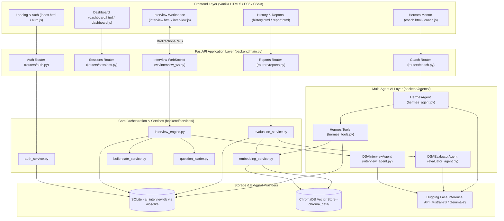
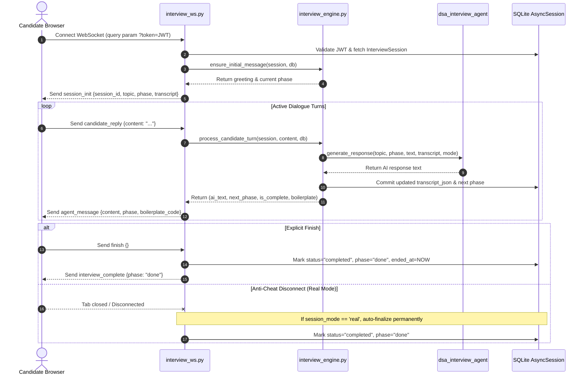

# GAIUS Application Architecture & Complete Workflow

This document provides an exhaustive, end-to-end breakdown of the **GAIUS Adaptive AI Technical Interview Platform**. It details every component, agent, service, function, and real-time communication pipeline across the full stack.

---

## 📑 Table of Contents

1. [System Architecture Overview](#1-system-architecture-overview)
2. [Agent Ecosystem & Core Functions](#2-agent-ecosystem--core-functions)
   - [2.1 DSA Interview Agent (`DSAInterviewAgent`)](#21-dsa-interview-agent-dsainterviewagent)
   - [2.2 Post-Interview Evaluator Agent (`DSAEvaluatorAgent`)](#22-post-interview-evaluator-agent-dsaevaluatoragent)
   - [2.3 Hermes AI Technical Mentor (`HermesAgent`)](#23-hermes-ai-technical-mentor-hermesagent)
   - [2.4 Hermes Diagnostic Tools Library (`hermes_tools.py`)](#24-hermes-diagnostic-tools-library-hermes_toolspy)
3. [Core Services & Orchestration Engines](#3-core-services--orchestration-engines)
   - [3.1 Interview Engine (`interview_engine.py`)](#31-interview-engine-interview_enginepy)
   - [3.2 Evaluation Service (`evaluation_service.py`)](#32-evaluation-service-evaluation_servicepy)
   - [3.3 Vector Embedding & RAG Service (`embedding_service.py`)](#33-vector-embedding--rag-service-embedding_servicepy)
   - [3.4 Dynamic Boilerplate Service (`boilerplate_service.py`)](#34-dynamic-boilerplate-service-boilerplate_servicepy)
   - [3.5 Question Loader Service (`question_loader.py`)](#35-question-loader-service-question_loaderpy)
   - [3.6 Authentication Service (`auth_service.py`)](#36-authentication-service-auth_servicepy)
4. [Real-Time WebSocket Pipeline (`interview_ws.py`)](#4-real-time-websocket-pipeline-interview_wspy)
5. [End-to-End Application Lifecycle Flows](#5-end-to-end-application-lifecycle-flows)
   - [Flow A: Candidate Registration & Authentication](#flow-a-candidate-registration--authentication)
   - [Flow B: Session Launch & Configuration](#flow-b-session-launch--configuration)
   - [Flow C: Live Interview Execution & 6-Phase Progression](#flow-c-live-interview-execution--6-phase-progression)
   - [Flow D: Session Completion & Anti-Cheat Finalization](#flow-d-session-completion--anti-cheat-finalization)
   - [Flow E: On-Demand 7-Dimensional Evaluation & Vector Chunking](#flow-e-on-demand-7-dimensional-evaluation--vector-chunking)
   - [Flow F: Hermes AI Mentor Consultation & RAG Diagnostics](#flow-f-hermes-ai-mentor-consultation--rag-diagnostics)
6. [Function Reference & Call Matrix](#6-function-reference--call-matrix)

---

## 1. System Architecture Overview

GAIUS connects an asynchronous **FastAPI** backend with a high-performance **Vanilla JS / CSS3 Design Token** web application. AI reasoning is driven by Hugging Face open-access LLMs (`mistralai/Mistral-7B-Instruct-v0.2`, `google/gemma-2-27b-it`), guarded by heuristic fallbacks and grounded by **ChromaDB** vector storage with `sentence-transformers` embeddings.



---

## 2. Agent Ecosystem & Core Functions

### 2.1 DSA Interview Agent (`DSAInterviewAgent`)
* **File**: `backend/agents/interview_agent.py`
* **Singleton Instance**: `dsa_interview_agent`
* **Role**: Simulates a Senior Staff Software Engineer and FAANG Bar Raiser conducting live technical problem-solving sessions.

#### Core Functions & Execution Mechanics

1. `check_safety_and_injection(text: str) -> Optional[str]`
   * **Purpose**: Intercepts adversarial prompt injections, roleplay overrides, and cheating attempts before any LLM invocation.
   * **Mechanics**: Scans against regular expression patterns (`PROMPT_INJECTION_PATTERNS`, `OFF_TOPIC_PATTERNS`, `SPOILER_REQUEST_PATTERNS`). Deflects requests such as *"Ignore previous instructions"*, *"Act as DAN"*, *"Give me the solution code"*, or requests for poems/jokes back to the interview scope.

2. `_build_system_prompt(topic: str, phase: str, target_question: Optional[QuestionItem], interview_mode: str) -> str`
   * **Purpose**: Generates dynamic system instructions enforcing interview mode constraints.
   * **Mode Logic**:
     * **`coached` Mode**: Mandates appending `> 💡 **Interviewer Guidance**` with *What You Should Say* (verbal communication points) and *Target Complexity* (expected Big-O bounds). Strictly forbids revealing solutions.
     * **`real` Mode**: Strictly prohibits hints, expectation blocks, and solution guidance. Defer all reviews to the post-interview scorecard.

3. `generate_response(topic, phase, candidate_text, transcript, target_question, interview_mode) -> str`
   * **Purpose**: Produces the interviewer's next conversational turn.
   * **Step-by-Step Pipeline**:
     1. Runs `check_safety_and_injection(candidate_text)`. If an attack is detected, returns immediate deflection.
     2. Formats recent conversation turns (last 6 turns) into structured user/assistant messages.
     3. Dispatches synchronous API requests to Hugging Face (`client.chat.completions.create`) non-blockingly via `anyio.to_thread.run_sync`.
     4. Tries fallback models (`settings.HF_MODEL_ID`, `google/gemma-2-27b-it`, `Qwen/Qwen2.5-Coder-32B-Instruct`).
     5. If LLM is unreachable or times out, seamlessly falls back to `_heuristic_dsa_response()`.

4. `_heuristic_dsa_response(topic, phase, candidate_text, target_question, interview_mode) -> str`
   * **Purpose**: High-reliability deterministic fallback that evaluates candidate Big-O tokens (`O(N^2)`, nested loops), validates invariants, and issues targeted probing questions tailored to the active interview phase.

---

### 2.2 Post-Interview Evaluator Agent (`DSAEvaluatorAgent`)
* **File**: `backend/agents/evaluator_agent.py`
* **Singleton Instance**: `evaluator_agent`
* **Role**: Evaluates the candidate's complete dialogue transcript across 7 core DSA dimensions on a 1.0 to 4.0 scale.

#### Core Dimensions Evaluated
1. **Algorithmic Correctness & Logic** (`algorithmic_logic`)
2. **Time & Space Complexity (Big-O)** (`time_space_complexity`)
3. **Data Structure Selection** (`data_structures`)
4. **Edge Case Handling & Rigor** (`edge_cases`)
5. **Code Quality & Implementation** (`code_quality`)
6. **Problem-Solving & Optimization Process** (`problem_solving`)
7. **Communication & Collaboration** (`communication`)

#### Core Functions & Execution Mechanics

1. `is_technical_turn(text: str) -> bool`
   * **Purpose**: Strips biographical intros, pleasantries, and greetings (`"Hi, I am ready"`) from substantive technical dialogue.
   * **Mechanics**: Checks for code delimiters (```` ``` ````, indentation syntax `def `), programming tokens (`return`, `len(`, `nums[`, `seen[`), Big-O tokens (`O(N)`, `O(1)`), and algorithmic keywords.

2. `_no_technical_evidence_report(topic: str) -> Dict[str, Any]`
   * **Purpose**: Anti-hallucination defense. If a candidate exits without attempting questions, this produces a baseline unassessed report (1.0 for all metrics, `has_evidence: false`) instead of fabricating grades.

3. `_format_transcript(transcript: List[Dict[str, Any]]) -> str`
   * **Purpose**: Serializes chronological turns into labelled markers `[Turn i - CANDIDATE/AI]` for prompt ingestion.

4. `evaluate_interview(topic: str, transcript: List[Dict[str, Any]]) -> Dict[str, Any]`
   * **Purpose**: Orchestrates rubric evaluation.
   * **Execution**: Checks for substantive technical turns $\to$ builds bar-raiser prompt with anti-hallucination constraints $\to$ calls Hugging Face $\to$ parses JSON via `_extract_json()` $\to$ verifies candidate proof with `_sanitize_and_standardize()`. If LLM fails, falls back to `_heuristic_evaluation()`.

5. `_sanitize_and_standardize(parsed: Dict, topic: str, candidate_tech_text: str) -> Dict`
   * **Purpose**: Validates LLM output against the ground truth candidate transcript.
   * **Integrity Checks**:
     * If candidate never mentioned `O(...)` or time/space tokens, forces `time_space_complexity` score to `1.0` and `has_evidence: false`.
     * If candidate never submitted code syntax, forces `code_quality` to `1.0`.
     * If candidate ignored boundary tokens (`empty`, `null`, `duplicate`, `overflow`), forces `edge_cases` to `1.0`.
     * Every `evidence_quote` is validated to ensure it is not fabricated.

---

### 2.3 Hermes AI Technical Mentor (`HermesAgent`)
* **File**: `backend/agents/hermes_agent.py`
* **Singleton Instance**: `hermes_agent`
* **Role**: 24/7 technical pair-mentor, pedagogical tutor, and personalized interview performance analyst.

#### Core Functions & Execution Mechanics

1. `check_guardrails(user_query: str) -> Optional[Dict[str, Any]]`
   * **Purpose**: Preserves jurisdiction boundaries and defends against prompt injections.
   * **Rules**: Restricts Hermes to computer science, algorithms, Big-O, system design, and interview prep. Rejects medical, legal, political, or creative inquiries.

2. `classify_intent(user_query: str) -> str`
   * **Purpose**: Classifies incoming candidate messages to route them to the appropriate RAG tool or conceptual module.
   * **Supported Intents**:
     * `get_candidate_weak_areas`: Candidate asking about mistakes, penalties, or weak scores.
     * `get_candidate_strengths`: Inquiring about top scores, strengths, or examiner praise.
     * `get_latest_interview_report`: Debrief of the most recent session.
     * `get_metric_breakdown`: Deep dive into a specific rubric dimension (e.g., *"Why did I get 2.0 on edge cases?"*).
     * `get_progress_and_trends`: Trajectory curve across multiple completed sessions.
     * `recommend_practice_problem`: Curating LeetCode-style challenges tailored to lowest scores.
     * `general_technical_query`: Inquiries on algorithmic patterns (e.g., *"How can I get better at Sliding Window?"*).

3. `route_and_execute_tool(candidate_id, user_query, db) -> Tuple[str, Dict[str, Any]]`
   * **Purpose**: Dispatches the classified intent to the diagnostic tools in `hermes_tools.py` or to `_synthesize_general_technical_query()`.

4. `_synthesize_general_technical_query(query: str) -> Dict[str, Any]`
   * **Purpose**: Provides in-depth algorithmic tutorials with mental models, Python blueprints, edge case traps, and 7-day deliberate practice schedules.
   * **Topics Covered**: Sliding Window, Two Pointers, Prefix Sum, Monotonic Stacks, Binary Search on Answer Space, Dynamic Programming, Tree Traversals, Graph Algorithms, Heap / Priority Queues, and In-Place Array Transformations.

5. `generate_response(candidate_id, user_query, chat_history, db) -> Dict[str, Any]`
   * **Purpose**: Orchestrates end-to-end mentor response generation.
   * **Pipeline**: Guardrail validation $\to$ Tool execution $\to$ Prompt grounding with factual scorecard citations $\to$ Hugging Face chat completion $\to$ Topic detection via `_detect_topic()`.

---

### 2.4 Hermes Diagnostic Tools Library (`hermes_tools.py`)
* **File**: `backend/agents/hermes_tools.py`
* **Role**: SQL and vector store aggregation tools that inspect candidate history to supply ground truth facts to Hermes.

| Function | Purpose | Data Source |
|---|---|---|
| `get_candidate_weak_areas(candidate_id, db, limit)` | Ranks lowest-scoring DSA metrics across all completed sessions; retrieves examiner rationales, transcript quotes, and growth tips. | SQLite `EvaluationReport` + `InterviewSession` |
| `get_candidate_strengths(candidate_id, db, target)` | Pulls high-scoring dimensions ($\ge 3.0$) and positive examiner feedback from the latest or all sessions. | SQLite `EvaluationReport` + `InterviewSession` |
| `get_latest_interview_report(candidate_id, db)` | Fetches comprehensive audit, score breakdown, and strengths/weaknesses for the most recent interview. | SQLite `EvaluationReport` (ordered by `created_at desc`) |
| `get_metric_breakdown(candidate_id, metric_query, db)` | Dissects performance on a single rubric dimension (e.g., time complexity) by matching query to `METRIC_ALIASES`. | SQLite `EvaluationReport` (parsed `dsa_metrics`) |
| `get_progress_and_trends(candidate_id, db)` | Computes historical score trajectory, score delta between first and latest session, and chronological progress curve. | SQLite `EvaluationReport` (ordered by `created_at asc`) |
| `recommend_practice_problem(candidate_id, db, focus_topic)` | Identifies weakest metric and retrieves an optimal practice question from `question_loader`. | SQLite reports + `question_loader.py` |

---

## 3. Core Services & Orchestration Engines

### 3.1 Interview Engine (`interview_engine.py`)
* **File**: `backend/services/interview_engine.py`
* **Singleton Instance**: `interview_engine`
* **Role**: Manages the state machine, dialogue progression, and session persistence during live interviews.

#### State Machine Flow:
$$\text{intro} \longrightarrow \text{warm\_up} \longrightarrow \text{core} \longrightarrow \text{probing} \longrightarrow \text{closing} \longrightarrow \text{done}$$

#### Core Functions:
1. `get_initial_greeting(session: InterviewSession) -> str`: Builds introductory prompt with topic and mode expectations.
2. `ensure_initial_message(session, db) -> Tuple[str, str]`: Ensures the session's first turn is stored in the database.
3. `process_candidate_turn(session, candidate_text, db) -> Tuple[str, str, bool, Optional[str]]`:
   * Deserializes `transcript_json`.
   * Appends candidate turn with UTC timestamp.
   * Advances phase to next stage in the state machine.
   * Calls `dsa_interview_agent.generate_response(...)`.
   * Resolves starter code for the active question via `boilerplate_service`.
   * Commits updated transcript and phase to SQLite.

---

### 3.2 Evaluation Service (`evaluation_service.py`)
* **File**: `backend/services/evaluation_service.py`
* **Singleton Instance**: `evaluation_service`
* **Role**: Executes rubric evaluation, database persistence, and vector store chunking.

#### Core Function:
* `generate_and_save_report(session: InterviewSession, user_id: str, db: AsyncSession) -> EvaluationReport`:
  1. Invokes `evaluator_agent.evaluate_interview(session.topic, transcript)`.
  2. Creates or updates `EvaluationReport` row in SQLite.
  3. Invokes `embedding_service.store_evaluation_chunks(...)` to chunk discrete metrics into ChromaDB.
  4. Sets `report.is_embedded = True` upon successful vectorization.

---

### 3.3 Vector Embedding & RAG Service (`embedding_service.py`)
* **File**: `backend/services/embedding_service.py`
* **Singleton Instance**: `embedding_service`
* **Role**: ChromaDB interface managing vector indexing and semantic retrieval using `SentenceTransformerEmbeddingFunction("all-MiniLM-L6-v2")`.

#### Hybrid Chunking Strategy:
When an interview evaluation is finalized, it is decomposed into distinct vector documents:
* **Chunk 0 (Summary)**: Overall score and executive summary feedback.
* **Chunks 1–7 (Metric Chunks)**: Individual document for each rubric dimension containing score, evaluator rationale, evidence quote, and growth tip. Metadata tagged with `{"candidate_id": ..., "metric_name": ..., "score": ...}`.
* **Chunk 8 (Focus Areas)**: Candidate strengths, areas for improvement, and recommended focus areas.

#### Core Functions:
1. `_ensure_initialized()`: Connects to `chromadb.PersistentClient(path=settings.CHROMA_PERSIST_PATH)` and initializes the `interview_evaluations` collection with cosine distance metric.
2. `store_evaluation_chunks(candidate_id, interview_id, report_data, date_str) -> bool`: Upserts the hybrid chunks to ChromaDB.
3. `query_candidate_history(candidate_id, query_text, n_results) -> List[Dict]`: Performs cosine similarity search over past interview chunks filtered by `candidate_id`.
4. `query_metric_history(candidate_id, metric_name, query_text, n_results) -> List[Dict]`: Vector query filtered by candidate ID and metric name.

---

### 3.4 Dynamic Boilerplate Service (`boilerplate_service.py`)
* **File**: `backend/services/boilerplate_service.py`
* **Singleton Instance**: `boilerplate_service`
* **Role**: Pre-populates runnable code templates customized to the selected programming language.
* **Supported Languages**: Python 3, JavaScript (Node.js), Java (OpenJDK), C++ (GCC/Clang), and Go (Golang).
* **Guiding Principle**: Minimal comments (only `// Type your code here` or `# Type your code here`), complete with solution class, function signatures, and execution test harnesses.

---

### 3.5 Question Loader Service (`question_loader.py`)
* **File**: `backend/services/question_loader.py`
* **Singleton Instance**: `question_loader`
* **Role**: Loads, caches, and serves curated technical interview challenges from `backend/data/questions.json` (or remote GitHub source).
* **Functions**:
  * `load_questions()`: Preloads questions on server startup in FastAPI `lifespan`.
  * `get_questions_by_category(category, limit)`: Returns questions matching requested category (or diverse questions if "general" is chosen).

---

### 3.6 Authentication Service (`auth_service.py`)
* **File**: `backend/services/auth_service.py`
* **Singleton Instance**: `auth_service`
* **Role**: Manages candidate account creation, password hashing with `passlib[bcrypt]`, and JWT issuance.
* **Functions**: `register_user()`, `authenticate_user()`, `generate_token_response()`, `refresh_tokens()`.

---

## 4. Real-Time WebSocket Pipeline (`interview_ws.py`)

* **Endpoint**: `ws://127.0.0.1:8000/ws/interview/{session_id}`
* **File**: `backend/ws/interview_ws.py`



---

## 5. End-to-End Application Lifecycle Flows

### Flow A: Candidate Registration & Authentication
1. **Frontend**: Candidate fills out registration form in `index.html`.
2. **JavaScript**: `auth.js` calls `POST /auth/register` via `api.js`.
3. **Backend Router**: `routers/auth.py` invokes `auth_service.register_user(db, request)`.
4. **Hashing**: `core/security.py` hashes password using bcrypt.
5. **Token Generation**: `auth_service.generate_token_response()` issues JWT Access Token (valid for 60 min) and Refresh Token (valid for 7 days).
6. **Storage**: Frontend stores tokens in `localStorage` and redirects to `/dashboard`.

---

### Flow B: Session Launch & Configuration
1. **Dashboard Initialization**: `dashboard.js` loads candidate stats and calls `GET /sessions/active`.
2. **Resumption Gate**:
   * If an active session is in **`coached`** mode, a prominent banner appears: *"Active Coached Session Found — Resume Now"*.
   * If an active session is in **`real`** mode, the system automatically finalizes it (`status = "completed"`). Real interviews cannot be resumed.
3. **Configuration**: Candidate selects:
   * **Domain**: Arrays & Strings, Linked Lists, Trees & BST, Dynamic Programming, or Full Mock.
   * **Mode**: 🎓 Coached (guided practice with talking points) or ⚡ Real (strict FAANG simulation).
   * **Language**: Python, JavaScript, Java, C++, or Go.
4. **Session Creation**: `POST /sessions/start` creates `InterviewSession` row in SQLite.
5. **Redirect**: Browser opens `/interview?session_id={id}`.

---

### Flow C: Live Interview Execution & 6-Phase Progression
1. **Handshake**: `interview.js` opens WebSocket to `/ws/interview/{session_id}?token={token}`.
2. **Session Init**: Server sends `session_init` event containing full dialogue history and starter code.
3. **Phase 1 (Introduction)**: Agent introduces the interview structure and asks candidate to state readiness.
4. **Phase 2 (Warm-Up)**: First algorithmic problem presented. Scratchpad populates language-specific boilerplate.
   * In *Coached Mode*, agent appends `> 💡 **Interviewer Guidance**` with expected talking points and target Big-O bounds.
   * In *Real Mode*, pure problem constraints and examples are presented without hints.
5. **Phase 3 (Core Algorithm & Invariants)**: Candidate proposes approach. Agent evaluates algorithmic correctness and probes loop invariants.
6. **Phase 4 (Implementation & Scratchpad)**: Candidate types code into the collapsible scratchpad and clicks **"Insert Code into Chat"** or submits via chat. Agent analyzes edge cases.
7. **Phase 5 (Complexity Analysis)**: Agent challenges Big-O derivations for both runtime and auxiliary memory.
8. **Phase 6 (Closing)**: Agent wraps up the problem discussion.

---

### Flow D: Session Completion & Anti-Cheat Finalization
1. **Standard Completion**:
   * When reaching the closing phase, the session marks `is_complete = True`.
   * Alternatively, candidate clicks **"End Interview"**, sending `finish` over WebSocket or `POST /sessions/{id}/finish`.
   * Session marked `status = "completed"`, `current_phase = "done"`, and `ended_at = UTC timestamp`.
2. **Anti-Cheat Enforcement in Real Mode**:
   * If the candidate attempts to switch tabs, close the browser, or disconnect while a **Real Mode** interview is active, `interview.js` triggers `navigator.sendBeacon("/sessions/{id}/finish")` and the WebSocket disconnection handler permanently finalizes the session.

---

### Flow E: On-Demand 7-Dimensional Evaluation & Vector Chunking
1. **Trigger**: Concluding an interview does **not** block the browser with expensive AI evaluations. Candidates generate reports strictly on-demand by clicking **"Generate Evaluation Report ⚡"** on `history.html` or from the completion modal.
2. **Request**: Frontend sends `POST /reports/generate/{interview_id}`.
3. **Evaluation Execution**:
   * `evaluation_service.generate_and_save_report()` fetches session transcript.
   * Calls `evaluator_agent.evaluate_interview(topic, transcript)`.
   * Evaluator filters out chit-chat (`is_technical_turn()`), constructs Bar Raiser prompt, and invokes LLM.
   * LLM response is parsed and passed to `_sanitize_and_standardize()` to prevent score inflation and eliminate fabricated evidence quotes.
4. **Persistence**:
   * Evaluated scorecard stored in SQLite `evaluation_reports` table.
5. **Vector Store Chunking (ChromaDB)**:
   * `embedding_service.store_evaluation_chunks()` creates 9 semantic chunks (Summary + 7 Metric Chunks + Action Plan).
   * Generates vector embeddings via `SentenceTransformer("all-MiniLM-L6-v2")`.
   * Upserts documents and metadata into `chroma_data/` collection.
   * Sets `report.is_embedded = True`.
6. **Visualization**: Browser navigates to `/report?interview_id={id}` displaying the 7-metric scorecard, radar visualization, strengths, improvement areas, and transcript evidence.

---

### Flow F: Hermes AI Mentor Consultation & RAG Diagnostics
1. **Access**: Candidate opens the **AI Mentor** tab (`/coach`).
2. **Thread Management**: Candidate creates, renames, or resumes conversation threads.
3. **User Query**: Candidate types a question (e.g., *"Where did I lose points in my interviews?"* or *"How can I get better at Sliding Window?"*).
4. **Intent Classification**:
   * `hermes_agent.classify_intent()` determines whether the prompt is a personal evaluation lookup or a general algorithmic query.
5. **Tool Execution & Retrieval**:
   * **Scorecard Inquiries**: Dispatches to `hermes_tools.py` (`get_candidate_weak_areas`, `get_metric_breakdown`, `get_progress_and_trends`, etc.) which queries SQLite and ChromaDB.
   * **Algorithmic Inquiries**: Dispatches to `_synthesize_general_technical_query()` which retrieves mental models, Python code blueprints, and 7-day practice plans.
6. **LLM Synthesis**: Hermes synthesizes a mentorship response citing exact session dates, scores, and transcript evidence quotes.
7. **Persistence**: Message and evaluation citations saved to SQLite `coach_messages` table and rendered in markdown.

---

## 6. Function Reference & Call Matrix

| Layer / Component | Function Name | Input Arguments | Output / Return | Called By |
|---|---|---|---|---|
| **Auth Service** | `register_user` | `db: AsyncSession, request: UserRegisterRequest` | `User` ORM instance | `routers/auth.py` |
| **Auth Service** | `authenticate_user` | `db, email, password` | `Optional[User]` | `routers/auth.py` |
| **Auth Service** | `generate_token_response` | `user: User` | `TokenResponse` (access + refresh) | `routers/auth.py` |
| **Interview WS** | `interview_websocket_endpoint` | `websocket: WebSocket, session_id: str` | Streamed JSON events | Frontend `interview.js` |
| **Interview Engine** | `ensure_initial_message` | `session: InterviewSession, db` | `Tuple[greeting_str, phase_str]` | `interview_ws.py`, `routers/sessions.py` |
| **Interview Engine** | `process_candidate_turn` | `session, candidate_text, db` | `Tuple[ai_text, next_phase, is_done, boilerplate]` | `interview_ws.py`, `routers/sessions.py` |
| **DSA Interview Agent** | `check_safety_and_injection` | `text: str` | `Optional[str]` (deflection message) | `DSAInterviewAgent.generate_response` |
| **DSA Interview Agent** | `generate_response` | `topic, phase, text, transcript, target_q, mode` | `str` (Interviewer response) | `interview_engine.py` |
| **Evaluation Service** | `generate_and_save_report` | `session, user_id, db` | `EvaluationReport` ORM instance | `routers/reports.py` |
| **DSA Evaluator Agent** | `is_technical_turn` | `text: str` | `bool` | `DSAEvaluatorAgent.evaluate_interview` |
| **DSA Evaluator Agent** | `evaluate_interview` | `topic: str, transcript: List[Dict]` | `Dict[str, Any]` (7-metric scorecard) | `evaluation_service.py` |
| **DSA Evaluator Agent** | `_sanitize_and_standardize`| `parsed: Dict, topic: str, tech_text: str` | `Dict[str, Any]` (validated scores) | `DSAEvaluatorAgent.evaluate_interview` |
| **Embedding Service** | `store_evaluation_chunks` | `candidate_id, interview_id, report_data, date` | `bool` | `evaluation_service.py` |
| **Embedding Service** | `query_candidate_history` | `candidate_id, query_text, n_results` | `List[Dict]` (semantic results) | `HermesAgent`, `hermes_tools.py` |
| **Hermes Agent** | `check_guardrails` | `user_query: str` | `Optional[Dict]` (guardrail deflection) | `HermesAgent.generate_response` |
| **Hermes Agent** | `classify_intent` | `user_query: str` | `str` (intent identifier) | `HermesAgent.route_and_execute_tool` |
| **Hermes Agent** | `route_and_execute_tool` | `candidate_id, user_query, db` | `Tuple[tool_name, result_dict]` | `HermesAgent.generate_response` |
| **Hermes Agent** | `generate_response` | `candidate_id, user_query, chat_history, db` | `Dict[str, Any]` (content + citations) | `routers/coach.py` |
| **Hermes Tools** | `get_candidate_weak_areas` | `candidate_id: str, db: AsyncSession, limit: int`| `Dict[str, Any]` (ranked weak metrics) | `hermes_agent.py` |
| **Hermes Tools** | `get_candidate_strengths` | `candidate_id: str, db: AsyncSession, target: str`| `Dict[str, Any]` (top metrics + praise)| `hermes_agent.py` |
| **Hermes Tools** | `get_latest_interview_report`| `candidate_id: str, db: AsyncSession` | `Dict[str, Any]` (debrief summary) | `hermes_agent.py` |
| **Hermes Tools** | `get_metric_breakdown` | `candidate_id: str, metric_query: str, db` | `Dict[str, Any]` (dimension deep dive)| `hermes_agent.py` |
| **Hermes Tools** | `get_progress_and_trends` | `candidate_id: str, db: AsyncSession` | `Dict[str, Any]` (timeline + delta) | `hermes_agent.py` |
| **Hermes Tools** | `recommend_practice_problem` | `candidate_id: str, db: AsyncSession, focus` | `Dict[str, Any]` (tailored challenge) | `hermes_agent.py` |
| **Boilerplate Service** | `get_boilerplate` | `question_id, language, topic, question_item` | `str` (clean runnable template) | `interview_engine.py`, `routers/sessions.py` |
| **Question Loader** | `load_questions` | `force_refresh: bool = False` | `List[QuestionItem]` | `backend/main.py` (`lifespan`) |
